# DESPLIEGUE — Evidencias y respuestas

Este documento recopila todas las evidencias y respuestas de la practica.

---

## Parte 1 — Evidencias minimas

### Fase 1: Instalacion y configuracion

1) Servicio Nginx activo
- Que demuestra: Que los contenedores estan creados y activos
- Comando: docker compose ps
- Evidencia:

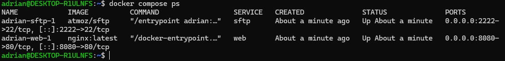

2) Configuracion cargada
- Que demuestra: que la configuracion esta cargada en nginx
- Comando: ls -l /etc/nginx/conf.d/
- Evidencia:

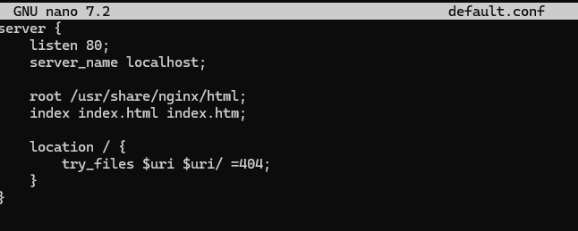

3) Resolucion de nombres
- Que demuestra: Que se puede acceder usando un nombre en vez del localhost
- Evidencia:

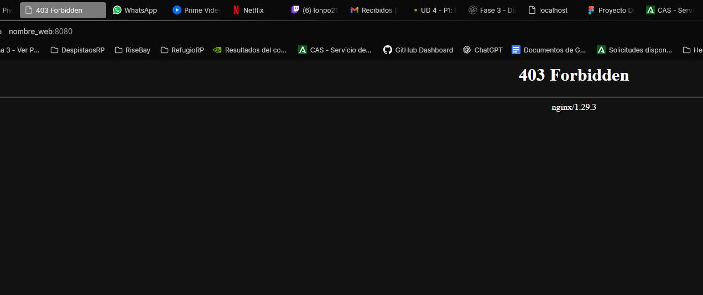

4) Contenido Web
- Que demuestra: Que se ha añadido el contenido a nginx y se accede desde el navegador
- Evidencia:
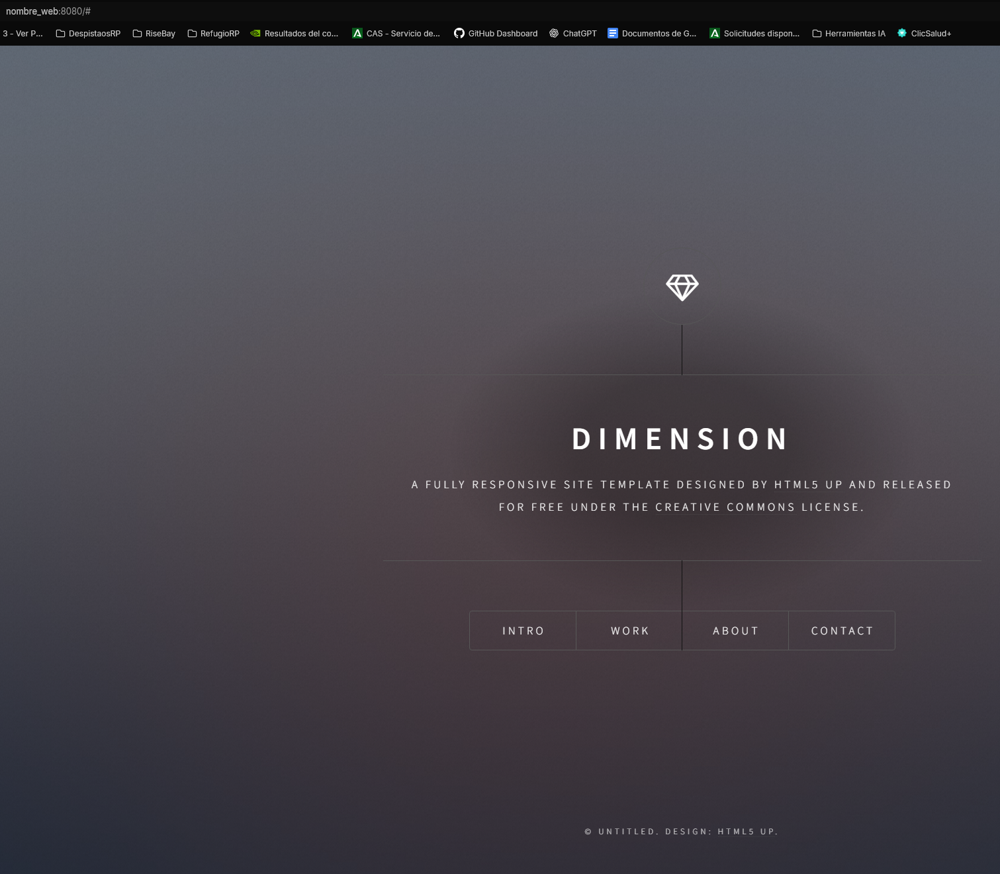

### Fase 2: Transferencia SFTP (Filezilla)

5) Conexion SFTP exitosa
- Que demuestra: Que he conseguido conectarme de forma exitosa desde Filezilla a travez de SFTP para subir los archivos a nginx
- Evidencia:

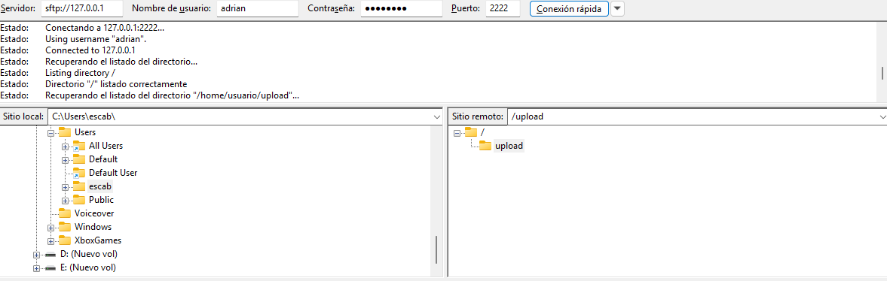

6) Permisos de escritura
- Que demuestra: Que tengo permisos de escritura pudiendo subir archivos al directorio upload
- Evidencia:

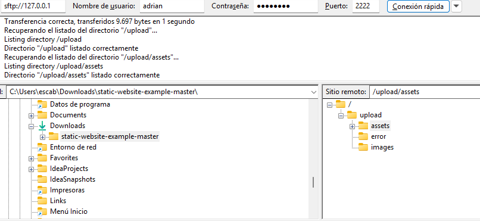

### Fase 3: Infraestructura Docker

7) Contenedores activos
- Que demuestra: Que los contenedores estan activos
- Comando: docker compose ps
- Evidencia:

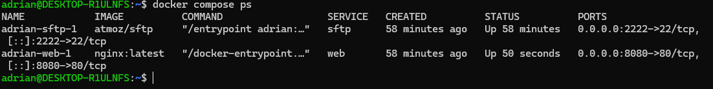

8) Persistencia (Volumen compartido)
- Que demuestra: Que el directorio upload se comparte tanto para la pagina principal como para la del reloj
- Evidencia:

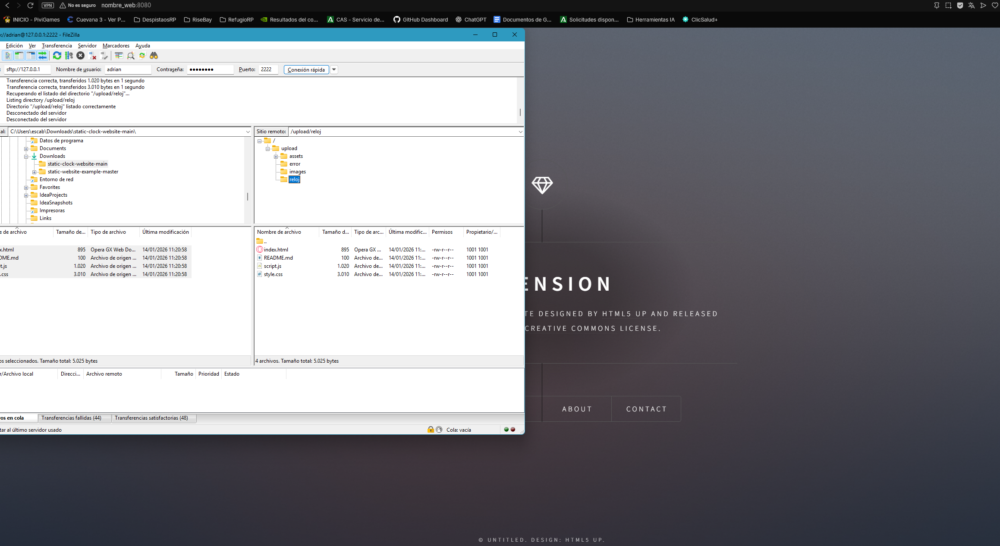

9) Despliegue multi-sitio
- Que demuestra: Que se puede acceedr al segundo sitio desde la misma pagina
- Evidencia:

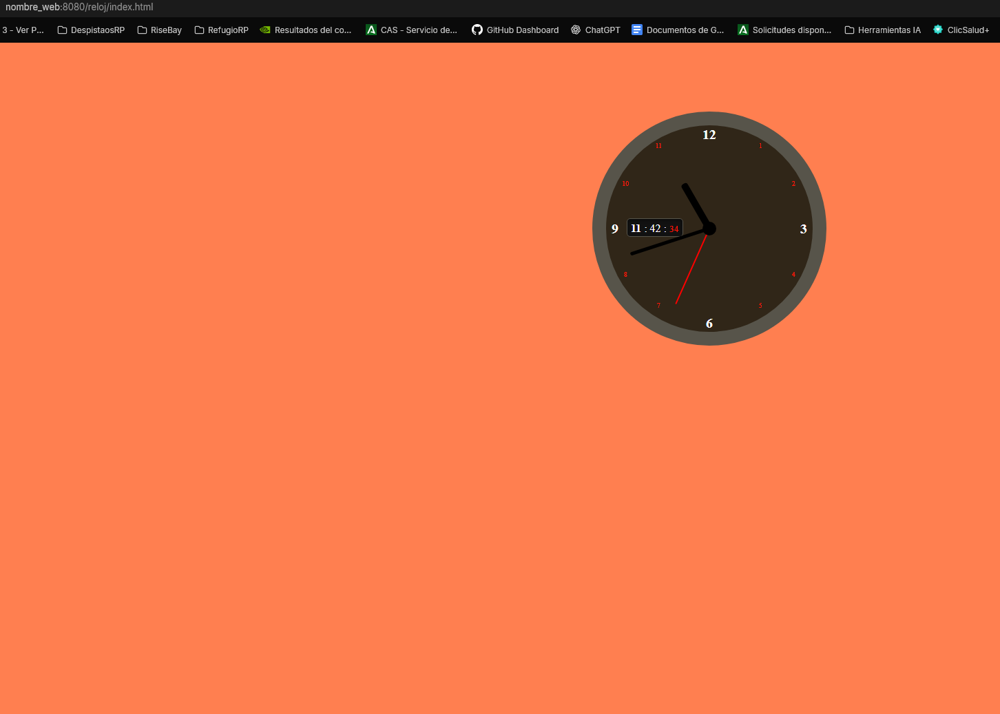

### Fase 4: Seguridad HTTPS

10) Cifrado SSL
- Que demuestra: El cifrado SSL con la conexion HTTPS autofirmado por mi
- Evidencia:

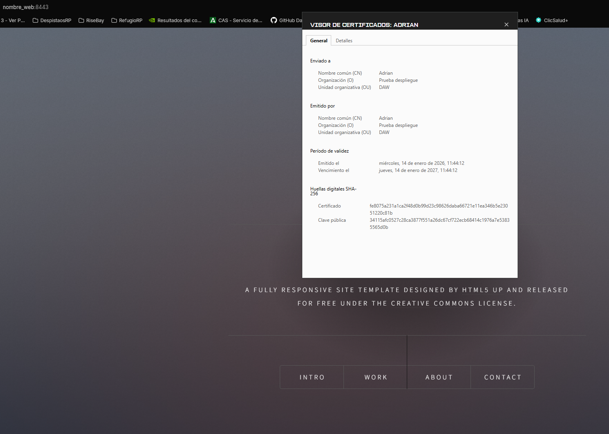

11) Redireccion forzada
- Que demuestra: Que al conectarme por HTTP lo primero que hace es la redireccion a HTTPS
- Evidencia:

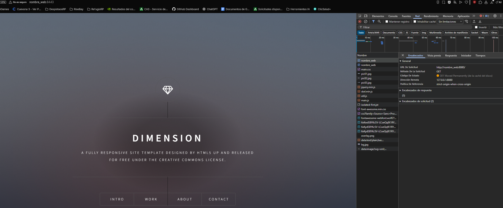

---

## Parte 2 — Evaluacion RA2 (a–j)

### a) Parametros de administracion
- Respuesta:
- Evidencias:
  - evidencias/a-01-grep-nginxconf.png
  - evidencias/a-02-nginx-t.png
  - evidencias/a-03-reload.png

### b) Ampliacion de funcionalidad + modulo investigado
- Opcion elegida (B1 o B2):
- Respuesta:
- Evidencias (B1 o B2):
  - evidencias/b1-01-gzipconf.png
  - evidencias/b1-02-compose-volume-gzip.png
  - evidencias/b1-03-nginx-t.png
  - evidencias/b1-04-curl-gzip.png
  - evidencias/b2-01-defaultconf-headers.png
  - evidencias/b2-02-nginx-t.png
  - evidencias/b2-03-curl-https-headers.png

#### Modulo investigado: <NOMBRE>
- Para que sirve:
- Como se instala/carga:
- Fuente(s):

### c) Sitios virtuales / multi-sitio
- Respuesta:
- Evidencias:
  - evidencias/c-01-root.png
  - evidencias/c-02-reloj.png
  - evidencias/c-03-defaultconf-inside.png

### d) Autenticacion y control de acceso
- Respuesta:
- Evidencias:
  - evidencias/d-01-admin-html.png
  - evidencias/d-02-defaultconf-auth.png
  - evidencias/d-03-curl-401.png
  - evidencias/d-04-curl-200.png

### e) Certificados digitales
- Respuesta:
- Evidencias:
  - evidencias/e-01-ls-certs.png
  - evidencias/e-02-compose-certs.png
  - evidencias/e-03-defaultconf-ssl.png

### f) Comunicaciones seguras
- Respuesta: Se usa 2 bloques porque al entrar por el nombre y no por el puerto, el buscador entra directamente por HTTP y sino estuviera daria error en cambio de esa forma te redirige al que tiene HTTPS pudiendo acceder al contenido de la pagina.
- Evidencias: 
  - evidencias/f-01-https.png

 

 
  - evidencias/f-02-301-network.png

### g) Documentacion
- Respuesta:
- Evidencias: enlaces a todas las capturas

### h) Ajustes para implantacion de apps
- Respuesta:
- Evidencias:
  - 
  - 

### i) Virtualizacion en despliegue
- Respuesta:
- Evidencias:
  - 

### j) Logs: monitorizacion y analisis
- Respuesta:
- Evidencias:
  - evidencias/j-01-logs-follow.png
  - evidencias/j-02-metricas.png

---

## Checklist final

### Parte 1
- [X] 1) Servicio Nginx activo
- [x] 2) Configuracion cargada
- [X] 3) Resolucion de nombres
- [x] 4) Contenido Web (Cloud Academy)
- [x] 5) Conexion SFTP exitosa
- [x] 6) Permisos de escritura
- [x] 7) Contenedores activos
- [x] 8) Persistencia (Volumen compartido)
- [x] 9) Despliegue multi-sitio (/reloj)
- [x] 10) Cifrado SSL
- [x] 11) Redireccion forzada (301)

### Parte 2 (RA2)
- [ ] a) Parametros de administracion
- [ ] b) Ampliacion de funcionalidad + modulo investigado
- [ ] c) Sitios virtuales / multi-sitio
- [ ] d) Autenticacion y control de acceso
- [ ] e) Certificados digitales
- [x] f) Comunicaciones seguras
- [ ] g) Documentacion
- [ ] h) Ajustes para implantacion de apps
- [ ] i) Virtualizacion en despliegue
- [ ] j) Logs: monitorizacion y analisis
